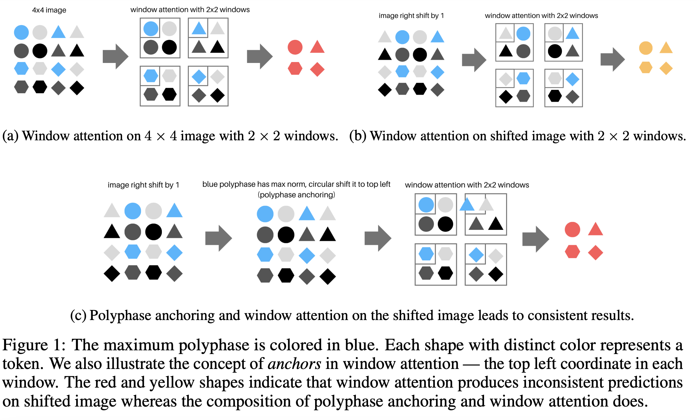

# Reviving Shift Equivariance in Vision Transformers
<!-- The latest version of this repo can be found at  -->

<!-- Updated Swin transformer (with polyphase implementations) is in models/swin_transformer_poly.py. -->

## Introduction

This is the official implementation of Reviving Shift Equivariance in Vision Transformers which proposes an adaptive polyphase anchoring algorithm that can be seamlessly integrated into vision transformer models to ensure shift-equivariance in patch embedding and subsampled attention modules, such as window attention and global subsampled attention. Our algorithms enable ViT, and its variants such as Twins to achieve 100% consistency with respect to input shift.

<!-- include image local path imgs/PolyModels.png -->

  


## Installation
We recommend using the pytorch docker `nvcr>=21.05` by
nvidia: https://catalog.ngc.nvidia.com/orgs/nvidia/containers/pytorch.


- Create a conda virtual environment and activate it:

```bash
conda create -n poly python=3.7 -y
conda activate poly
```

- Install `CUDA>=10.2` with `cudnn>=7` following
  the [official installation instructions](https://docs.nvidia.com/cuda/cuda-installation-guide-linux/index.html)
- Install `PyTorch>=1.8.0` and `torchvision>=0.9.0` with `CUDA>=10.2`:

```bash
conda install pytorch==1.8.0 torchvision==0.9.0 cudatoolkit=10.2 -c pytorch
```

- Install `timm==0.8.15dev0`:

```bash
pip install timm==0.8.15dev0
```

- Install other requirements:

```bash
pip install opencv-python==4.4.0.46 termcolor==1.1.0 yacs==0.1.8 pyyaml scipy
```


## Usage

PolyPatch and PolyOrder from models/poly_utils.py can be used as plug-and-play  modules for helping achieve shift-equivariance in patch embedding and subsampled attention modules. 

Integration of them in common ViT - polyVIT and Twin - PolyTwins architectures can be found in models/vision_transformer.py and models/polytwins.py respectively.

## Validation

Pre-trained weights can be supplied to eval.py to evaluate the performance, consistency, and robustness of the models. You can download our pretrained model checkpoints from [this Google Drive folder]( https://drive.google.com/drive/folders/193u1uxb-pWS-JeeqbG1T0MZDVXSVVqfp?usp=share_link).

Some common arguments are:

```
model: model name [vit, polyvit, twins, polytwins]
data-path: path to dataset
model_card: model card from timm 
pretrained_path: path to the pretrained checkpoints folder 
ckpt_num: which checkpoint to use in the pretrained checkpoints folder 
write_csv: whether output a csv file
random_affine: evaluate images under random affine transformation 
crop: evaluate images under cropping
flip: evaluate images under flipping
```

```
python eval.py --model polyvit --model_card timm/vit_base_patch16_224.augreg_in1k --data_path ./data_path --batch_size 64 --pretrained_path ./pretrained_path --ckpt_num ckpt_num --write_csv 
```

## Training
Models can be trained using train.py, config files in configs directory can be used to set training and model hyperparameters and architecture.

Sample command for training Twins_B-poly on ImageNet dataset is:

```
torchrun --nnodes 1 --nproc_per_node 4  --master_port 41368 main.py --cfg configs/ptwins_svts_base.yaml --data-path ~/data_path --output ./output

```
<!-- 
Sample command for training ViT_S/16-poly on ImageNet dataset is:

```
torchrun --nnodes 1 --nproc_per_node 4  --master_port 41368 main.py --cfg configs/pvit_small.yaml --data-path ~/data_path --output ./output

```
 -->
 
 ## Repository Reference 
 Code based on Swin Transformer [repo](https://github.com/microsoft/Swin-Transformer). 

